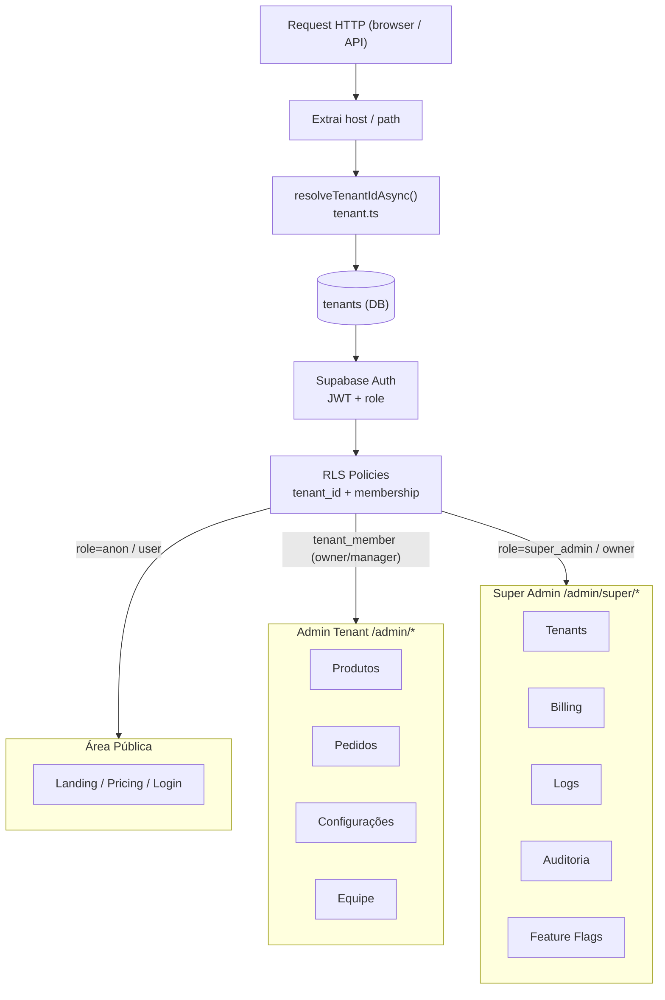

# Guia Prático — SaaS com Super Admin + Tenant Admin + Billing

> **Para quem:** devs do projeto e qualquer instrução para o Lovable.  
> **Status do repositório:** base multi-tenant implementada (Fases 7–8, ver [MULTITENANT_DESIGN.md](MULTITENANT_DESIGN.md)). Este guia descreve a evolução para um SaaS completo com 3 camadas distintas.  
> **Não substitui:** [MULTITENANT_DESIGN.md](MULTITENANT_DESIGN.md) (design técnico de RLS/tenant_id) nem a [auditoria de módulos](audit-modulos-projeto.md). **Complementa** com a visão de produto e o mapa do painel Super Admin.

---

## Referências Oficiais (estudar nesta ordem)

| # | Fonte | Por que estudar |
|---|-------|-----------------|
| 1 | [Vercel for Platforms](https://vercel.com/docs/multi-tenant) | Tenants, domínios customizados, subdomínios wildcard, roteamento por host. |
| 2 | [Supabase Auth](https://supabase.com/docs/guides/auth) | Autenticação, sessão, providers, proteção de rotas. |
| 3 | [Supabase JWT Claims + RLS](https://supabase.com/docs/guides/auth/jwt-fields) | Isolamento por `tenant_id`, permissões via claims, policies. |
| 4 | [Stripe SaaS / Billing](https://docs.stripe.com/saas) | Planos, assinaturas, portal do cliente, invoices, trial, inadimplência. |
| 5 | [Next.js + shadcn/ui Admin Dashboard](https://vercel.com/templates/next.js/next-js-and-shadcn-ui-admin-dashboard) | Referência visual e estrutural de painel admin. |
| 6 | [Supabase Logs / Observabilidade](https://supabase.com/docs/guides/telemetry/logs) | Logs Explorer, auditoria, Postgres logs, Edge Function logs. |

---

## 1. Arquitetura em 3 Camadas

O problema central de SaaS com super admin é a **falta de separação clara entre quem opera a plataforma e quem usa a plataforma**. Lovable e ferramentas similares geram painéis únicos sem essa hierarquia. A solução é formalizar 3 camadas:

```
┌─────────────────────────────────────────────────────────────┐
│  CAMADA 1 — SUPER ADMIN  (operador da plataforma)           │
│  Acesso: role super_admin / owner                           │
│  Controla: tenants, planos, billing, auditoria, flags       │
├─────────────────────────────────────────────────────────────┤
│  CAMADA 2 — ADMIN DO TENANT  (operador da loja/empresa)     │
│  Acesso: tenant_member com papel admin/manager/operator     │
│  Controla: dados da PRÓPRIA loja (produtos, pedidos, config)│
├─────────────────────────────────────────────────────────────┤
│  CAMADA 3 — USUÁRIO DO TENANT  (cliente final)              │
│  Acesso: user autenticado do tenant                         │
│  Controla: sua própria conta, pedidos e favoritos           │
└─────────────────────────────────────────────────────────────┘
```

### Camada 1 — Super Admin (plataforma)

- **Quem é:** o time da plataforma (você e os devs/sócios do negócio SaaS).
- **O que controla:** todas as contas (tenants), planos e cobrança, suporte global, auditoria cross-tenant, feature flags, saúde da infraestrutura.
- **Como acessa:** role `super_admin` ou `owner` em `user_roles`; verificado por [`useRequireSuperAdmin`](../src/hooks/useRequireSuperAdmin.ts); rotas sob `/admin/super/*`.
- **Princípio:** bypassa RLS de tenant via service role **apenas em rotas controladas** com checagem explícita de role. Nunca expõe service role key no client.

### Camada 2 — Admin do Tenant (loja/empresa)

- **Quem é:** o dono ou equipe da loja que contratou a plataforma.
- **O que controla:** produtos, pedidos, categorias, banners, configurações, integrações e equipe do **próprio tenant**.
- **Como acessa:** `tenant_member` com papel `owner / manager / operator / viewer`; filtro por `tenant_id` em todas as queries; RLS no Supabase garante isolamento.
- **Princípio:** `tenant_id` nunca vem do client — deriva do host/path resolvido no servidor por [`tenant.ts`](../src/lib/tenant.ts). Referência: [supabase-multi-tenant-isolation](../.cursor/skills/supabase-multi-tenant-isolation/SKILL.md).

### Camada 3 — Usuário do Tenant (cliente final)

- **Quem é:** quem compra na loja ou usa a aplicação do tenant.
- **O que acessa:** conta própria, histórico de pedidos, favoritos.
- **Como é autorizado:** JWT do Supabase Auth + RLS por `user_id`; sem acesso a dados de outros usuários ou outros tenants.

---

## 2. Fluxo de Resolução de Tenant e Autorização



**Regras inegociáveis:**
- `middleware.ts` não consulta banco; só normaliza host → path reescrito.
- Server actions e route handlers re-resolvem `tenantId` a partir da sessão/host — nunca do body.
- RLS é a última barreira; filtros no código são defesa em profundidade.
- Super admin usa service role **somente em rotas server-side controladas**.

---

## 3. Modelo de Dados Alvo

### 3.1 Situação atual vs. alvo

| Entidade | Situação atual | Alvo |
|----------|----------------|------|
| `auth.users` | Supabase Auth, operacional | Sem mudança |
| `profiles` | Dados extras do usuário | Sem mudança |
| `tenants` | Existe: id, name, slug, domain, active | Adicionar: `plan`, `status` (`active/suspended/trial`), `trial_end` |
| `admin_members` | Membros de uma loja; sem `tenant_id` explícito | Migrar para `tenant_members` com `tenant_id` FK para `tenants` |
| `user_roles` | Enum `app_role: admin / user`; sem tenant | Estender ou criar tabela separada para roles do super admin (`super_admin / owner`) |
| `subscriptions` | Não existe | Criar (ver SQL abaixo) |
| `audit_logs` | `logAudit()` grava em tabela; verificar colunas | Garantir `tenant_id`, `user_id`, `action`, `payload`, `created_at` |
| `feature_flags` | Não existe | Criar (ver SQL abaixo) |

### 3.2 Schema alvo (SQL mínimo)

```sql
-- Estender tenants com billing/status
ALTER TABLE tenants ADD COLUMN IF NOT EXISTS plan TEXT NOT NULL DEFAULT 'starter';
ALTER TABLE tenants ADD COLUMN IF NOT EXISTS status TEXT NOT NULL DEFAULT 'active';
ALTER TABLE tenants ADD COLUMN IF NOT EXISTS trial_end TIMESTAMPTZ;
ALTER TABLE tenants ADD COLUMN IF NOT EXISTS stripe_customer_id TEXT UNIQUE;

-- tenant_members: quem pertence a qual tenant
CREATE TABLE IF NOT EXISTS tenant_members (
  id          UUID PRIMARY KEY DEFAULT gen_random_uuid(),
  tenant_id   UUID NOT NULL REFERENCES tenants(id) ON DELETE CASCADE,
  user_id     UUID NOT NULL REFERENCES auth.users(id) ON DELETE CASCADE,
  role        TEXT NOT NULL DEFAULT 'viewer',   -- owner | manager | operator | viewer
  invited_by  UUID REFERENCES auth.users(id),
  invited_at  TIMESTAMPTZ,
  accepted_at TIMESTAMPTZ,
  is_active   BOOLEAN NOT NULL DEFAULT true,
  created_at  TIMESTAMPTZ NOT NULL DEFAULT now(),
  UNIQUE (tenant_id, user_id)
);

-- RLS em tenant_members
ALTER TABLE tenant_members ENABLE ROW LEVEL SECURITY;
CREATE POLICY "tenant_members_select" ON tenant_members
  FOR SELECT USING (
    user_id = auth.uid()
    OR EXISTS (
      SELECT 1 FROM user_roles ur
      WHERE ur.user_id = auth.uid()
        AND ur.role = 'admin'  -- super_admin bypassa
    )
  );

-- subscriptions: assinatura Stripe por tenant
CREATE TABLE IF NOT EXISTS subscriptions (
  id                       UUID PRIMARY KEY DEFAULT gen_random_uuid(),
  tenant_id                UUID NOT NULL REFERENCES tenants(id) ON DELETE CASCADE,
  stripe_customer_id       TEXT,
  stripe_subscription_id   TEXT UNIQUE,
  stripe_price_id          TEXT,
  plan                     TEXT NOT NULL DEFAULT 'starter',
  status                   TEXT NOT NULL DEFAULT 'incomplete',
  -- status: incomplete | active | trialing | past_due | canceled | unpaid
  trial_end                TIMESTAMPTZ,
  current_period_start     TIMESTAMPTZ,
  current_period_end       TIMESTAMPTZ,
  cancel_at_period_end     BOOLEAN NOT NULL DEFAULT false,
  canceled_at              TIMESTAMPTZ,
  created_at               TIMESTAMPTZ NOT NULL DEFAULT now(),
  updated_at               TIMESTAMPTZ NOT NULL DEFAULT now()
);

ALTER TABLE subscriptions ENABLE ROW LEVEL SECURITY;
CREATE POLICY "subscriptions_super_admin" ON subscriptions
  FOR ALL USING (
    EXISTS (
      SELECT 1 FROM user_roles ur
      WHERE ur.user_id = auth.uid() AND ur.role = 'admin'
    )
  );
-- Admins do tenant só lêem a própria assinatura
CREATE POLICY "subscriptions_tenant_read" ON subscriptions
  FOR SELECT USING (
    EXISTS (
      SELECT 1 FROM tenant_members tm
      WHERE tm.tenant_id = subscriptions.tenant_id
        AND tm.user_id = auth.uid()
        AND tm.is_active = true
    )
  );

-- audit_logs: quem fez o quê, quando e em qual tenant
CREATE TABLE IF NOT EXISTS audit_logs (
  id          UUID PRIMARY KEY DEFAULT gen_random_uuid(),
  tenant_id   UUID REFERENCES tenants(id),       -- null = ação de super admin global
  user_id     UUID REFERENCES auth.users(id),
  user_email  TEXT,
  action      TEXT NOT NULL,                      -- ex: 'product.created', 'tenant.suspended'
  resource    TEXT,                               -- ex: 'product', 'tenant', 'order'
  resource_id TEXT,
  payload     JSONB,
  ip          TEXT,
  user_agent  TEXT,
  created_at  TIMESTAMPTZ NOT NULL DEFAULT now()
);

ALTER TABLE audit_logs ENABLE ROW LEVEL SECURITY;
CREATE POLICY "audit_logs_super_admin" ON audit_logs
  FOR SELECT USING (
    EXISTS (
      SELECT 1 FROM user_roles ur
      WHERE ur.user_id = auth.uid() AND ur.role = 'admin'
    )
  );
CREATE POLICY "audit_logs_tenant" ON audit_logs
  FOR SELECT USING (
    tenant_id IS NOT NULL
    AND EXISTS (
      SELECT 1 FROM tenant_members tm
      WHERE tm.tenant_id = audit_logs.tenant_id
        AND tm.user_id = auth.uid()
        AND tm.role IN ('owner', 'manager')
        AND tm.is_active = true
    )
  );

-- feature_flags: flags globais ou por plano/tenant
CREATE TABLE IF NOT EXISTS feature_flags (
  id          UUID PRIMARY KEY DEFAULT gen_random_uuid(),
  key         TEXT NOT NULL,
  value       BOOLEAN NOT NULL DEFAULT false,
  scope       TEXT NOT NULL DEFAULT 'global',     -- global | plan:<nome> | tenant:<uuid>
  description TEXT,
  created_at  TIMESTAMPTZ NOT NULL DEFAULT now(),
  updated_at  TIMESTAMPTZ NOT NULL DEFAULT now(),
  UNIQUE (key, scope)
);

ALTER TABLE feature_flags ENABLE ROW LEVEL SECURITY;
CREATE POLICY "feature_flags_super_admin_write" ON feature_flags
  FOR ALL USING (
    EXISTS (
      SELECT 1 FROM user_roles ur
      WHERE ur.user_id = auth.uid() AND ur.role = 'admin'
    )
  );
CREATE POLICY "feature_flags_public_read" ON feature_flags
  FOR SELECT USING (scope = 'global' OR scope LIKE 'plan:%');
```

### 3.3 Nota de migração

O projeto atual tem `admin_members` sem `tenant_id` FK explícita e `user_roles` com enum `admin | user`. A migração recomendada:

1. Criar `tenant_members` como nova tabela (não renomear `admin_members` diretamente — manter retrocompatibilidade até a migração estar completa).
2. Fazer backfill: copiar registros de `admin_members` para `tenant_members` com `tenant_id = DEFAULT_TENANT_ID`.
3. Atualizar queries de permissão para usar `tenant_members` ao invés de `admin_members`.
4. Manter `admin_members` como readonly durante a transição; deprecar após validação.

---

## 4. Mapa do Painel Super Admin

### 4.1 Estrutura de rotas

| Área | Rota | Módulo / Página | Status atual |
|------|------|-----------------|--------------|
| **Super Admin** | `/admin/super` | Dashboard global (saúde, métricas, tenants ativos) | Parcial ([SuperAdmin.tsx](../src/pages/admin/SuperAdmin.tsx): saúde + catálogo APIs) |
| **Super Admin** | `/admin/super/tenants` | Listagem, criação, edição, suspensão de tenants | A criar |
| **Super Admin** | `/admin/super/tenants/:id` | Detalhe do tenant: dados, plano, billing, membros | A criar |
| **Super Admin** | `/admin/super/users` | Usuários globais: listar, bloquear, suporte | A criar |
| **Super Admin** | `/admin/super/billing` | Assinaturas, status, trial, inadimplência, invoices Stripe | A criar |
| **Super Admin** | `/admin/super/logs` | Logs de erros, webhooks, jobs (Supabase Logs + RPCs) | Parcial ([SystemAndLogs.tsx](../src/pages/admin/SystemAndLogs.tsx) e [CommerceHealth.tsx](../src/pages/admin/CommerceHealth.tsx)) |
| **Super Admin** | `/admin/super/audit` | Audit logs (quem, quando, tenant, ação) | Parcial (logAudit existe; falta UI dedicada) |
| **Super Admin** | `/admin/super/flags` | Feature flags por plano/tenant | A criar |
| **Super Admin** | `/admin/super/settings` | Configurações globais, limites por plano | A criar |
| **Admin Tenant** | `/admin` | Dashboard, pedidos, produtos, config, equipe | Existente e auditado |

### 4.2 Módulos detalhados do Super Admin

#### Dashboard Global

Métricas agregadas de toda a plataforma:
- Total de tenants ativos / em trial / suspensos / cancelados.
- MRR estimado (leitura das subscriptions).
- Tenants com problemas (webhooks falhos, inadimplência, erros).
- Saúde das integrações (já existe via `commerce_health` RPC).

#### Tenants

- Tabela com filtro por status (active / trial / suspended / canceled) e plano.
- Ações: ativar, suspender, trocar plano, acessar como admin (impersonation controlado com log de auditoria).
- Detalhe: configurações, membros, assinatura atual, histórico de invoices.
- Referência de UI: [admin-data-table skill](../.cursor/skills/admin-data-table/SKILL.md).

#### Usuários Globais

- Listagem de todos os usuários registrados com tenant associado.
- Ações: bloquear, redefinir senha, remover de tenant.
- Cuidado: impersonation deve gerar entry em `audit_logs`; nunca silencioso.

#### Billing

- Por tenant: stripe_customer_id, plano, status, trial_end, último invoice.
- Link direto para Stripe Customer Portal para gerenciar método de pagamento.
- Alertas de inadimplência (`past_due`) e cancelamentos.
- Webhook Stripe → atualiza `subscriptions` (idempotência via `stripe_subscription_id`).

#### Logs e Observabilidade

- Reaproveitar e expandir o que já existe:
  - [SystemAndLogs.tsx](../src/pages/admin/SystemAndLogs.tsx): logs de erro e auditoria.
  - [CommerceHealth.tsx](../src/pages/admin/CommerceHealth.tsx): saúde e webhooks Stripe.
- Adicionar: filtro por `tenant_id`, links para Supabase Logs Explorer.
- Referência: [OBSERVABILITY.md](OBSERVABILITY.md).

#### Auditoria

- Tabela `audit_logs` com filtro por tenant, usuário, ação e período.
- Exportação CSV.
- Ações críticas a registrar obrigatoriamente:
  - Criação/suspensão/ativação de tenant.
  - Troca de plano.
  - Impersonation.
  - Alteração de feature flags.
  - Bloqueio de usuário.

#### Feature Flags

- CRUD de flags com escopos: `global`, `plan:starter`, `plan:pro`, `tenant:<uuid>`.
- Leitura pelo admin do tenant: "quais features tenho habilitadas?"
- Sem persistência de flags no front-end — sempre ler do servidor.

---

## 5. Permissões e Guardrails

### 5.1 Hierarquia de roles

```
super_admin / owner   → acessa tudo (plataforma + todos os tenants)
    ↓
tenant owner          → acessa tudo do próprio tenant
tenant manager        → acessa maioria do próprio tenant (sem billing/membros)
tenant operator       → acesso operacional (pedidos, estoque, etc.)
tenant viewer         → apenas leitura
    ↓
user (cliente final)  → apenas própria conta
```

Mapeamento atual em [`permissions.ts`](../src/lib/permissions.ts) — evoluir para incluir escopos de tenant explicitamente.

### 5.2 Checklist de segurança (não negociar)

- `tenant_id` **nunca** vem do client como fonte de verdade.
- Toda Server Action re-resolve o tenant a partir da sessão ou host — não do body.
- Super admin usa `service_role` apenas em rotas server-side controladas, **com checagem de role antes**.
- `audit_logs` obrigatórios em ações destrutivas ou cross-tenant.
- Impersonation: gerar entry em `audit_logs` + mostrar banner "Você está acessando como tenant X".
- RLS habilitado em todas as tabelas sensíveis; negar por padrão; liberar explicitamente.

---

## 6. Prompt para o Lovable

> Copie o bloco abaixo e cole diretamente no chat do Lovable.

---

```
Contexto: este projeto é um SaaS de e-commerce multi-tenant com 3 camadas distintas:

1. **Super Admin (plataforma)** — acesso restrito ao time interno (role `super_admin`/`owner`). Controla todos os tenants, planos, billing Stripe, auditoria global, feature flags e observabilidade. Rotas em `/admin/super/*`.

2. **Admin do Tenant (loja)** — acesso pelo dono e equipe de cada loja (`tenant_member` com papel owner/manager/operator/viewer). Controla apenas os dados do próprio tenant (produtos, pedidos, clientes, configurações, equipe). Rotas em `/admin/*` (exceto super). Dados sempre filtrados por `tenant_id` no servidor.

3. **Usuário final** — cliente da loja; acessa apenas própria conta e pedidos. Rotas em `/conta` e `/loja/*`.

Stack: Next.js App Router + Supabase (Auth + RLS + Postgres) + Stripe Billing + shadcn/ui + Tailwind.

Tabelas críticas a respeitar ou criar:
- `tenants`: id, name, slug, domain, active, plan, status, trial_end, stripe_customer_id
- `tenant_members`: id, tenant_id, user_id, role, is_active
- `subscriptions`: id, tenant_id, stripe_subscription_id, stripe_price_id, plan, status, trial_end, current_period_end
- `audit_logs`: id, tenant_id, user_id, user_email, action, resource, resource_id, payload, created_at
- `feature_flags`: id, key, value, scope (global | plan:<nome> | tenant:<uuid>)

Regras obrigatórias:
- `tenant_id` nunca vem do client; sempre resolvido no servidor via host/path.
- RLS no Supabase é a barreira principal; filtros no código são defesa em profundidade.
- Super admin usa service_role apenas em server actions controladas com checagem de role.
- Billing/assinaturas via Stripe Billing: webhook confirma estado; nunca confiar só no front.
- Toda ação destrutiva ou cross-tenant grava em `audit_logs`.
- UI com shadcn/ui; sem lógica de negócio pesada em componentes de UI.

Modulo Super Admin a construir (rotas /admin/super/*):
- Dashboard global: métricas agregadas de tenants, MRR, saúde das integrações.
- Tenants: listagem (filtro por status/plano), criar, editar, suspender, ativar, trocar plano, ver billing e membros por tenant.
- Billing: assinatura por tenant, status, trial, inadimplência, link para Stripe Customer Portal.
- Logs: erros, webhooks Stripe, jobs — filtráveis por tenant.
- Auditoria: listagem de audit_logs por tenant/usuário/ação/período, exportação CSV.
- Feature flags: CRUD com escopos global/plan/tenant.
- Configurações globais: limites por plano, integrações globais.

Referência de design: siga o padrão já existente no projeto (shadcn/ui DataTable com TanStack Table, filtros server-side, paginação, bulk actions, estados loading/empty/error/success explícitos). Não criar mini-design-system paralelo — reutilizar componentes existentes.
```

---

## 7. Decisões e próximos passos

| Decisão | Recomendação | Justificativa |
|---------|-------------|---------------|
| Quando criar `tenant_members`? | Antes de qualquer nova feature do admin | Fundação necessária para isolamento correto. |
| Quando criar `subscriptions`? | Quando começar integração Stripe Billing | Schema mínimo definido neste guia. |
| Impersonation agora? | Não — logar para prioridade futura | Risco alto sem auditoria completa implementada. |
| Feature flags — tabela ou hardcoded? | Tabela desde o início | Flexibilidade para habilitar features por plano sem deploy. |
| Ampliar `user_roles` ou criar nova tabela? | Nova tabela `tenant_members` + manter `user_roles` apenas para super admin | Separação de contexto mais limpa. |
| Migrar `admin_members` → `tenant_members`? | Sim, com backfill gradual | Ver seção 3.3. |

---

## Relação com outros documentos

| Documento | Conteúdo | Relação com este guia |
|-----------|----------|-----------------------|
| [MULTITENANT_DESIGN.md](MULTITENANT_DESIGN.md) | Design técnico: RLS, `tenant_id`, função `get_current_tenant_id()`, fases 7–8 | Detalha a implementação SQL/RLS que este guia referencia na camada 2. |
| [audit-modulos-projeto.md](audit-modulos-projeto.md) | Inventário de todos os módulos, status de aderência, débitos | Auditoria do estado atual; este guia descreve o estado alvo. |
| [DATABASE_SCHEMA.md](DATABASE_SCHEMA.md) | Schema atual completo | Referência para entender o que já existe antes de criar novas tabelas. |
| [SECURITY_OVERVIEW.md](SECURITY_OVERVIEW.md) | Práticas de segurança do projeto | Complementa a seção de guardrails deste guia. |
| [OBSERVABILITY.md](OBSERVABILITY.md) | Logs, métricas e alertas | Referência para o módulo de Logs do Super Admin. |
